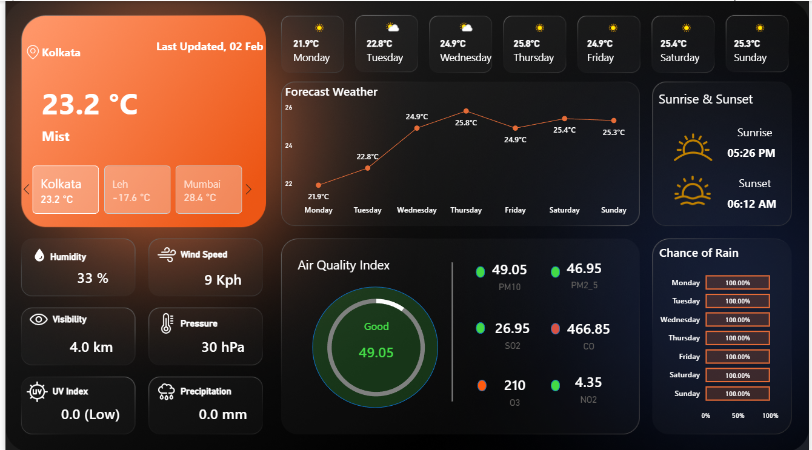
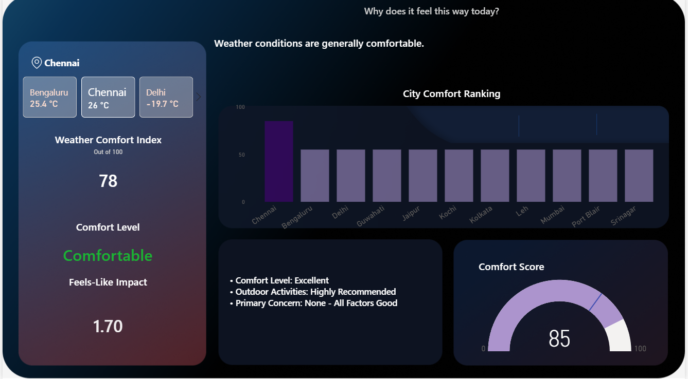

# 🌦️ Real-Time Weather Analytics Dashboard

An interactive **Power BI dashboard** that connects directly to a live **Weather API** to visualize real-time weather conditions, weekly forecasts, air quality metrics, and environmental indicators through an intuitive and business-friendly interface.

---

## 📸 Dashboard Preview

> Replace the image below with your dashboard screenshot after uploading it to the **Images** folder.

## 🏠 Home Dashboard

---

## 📊 Comfort Intelligence Dashboard

---

# 📖 Project Overview

This project demonstrates how live weather data can be transformed into meaningful insights using **Power BI**, **Power Query**, and **DAX**.

Weather data is fetched directly from a **Weather API**, cleaned and transformed in **Power Query**, and presented through an interactive dashboard that enables users to monitor current weather conditions, forecast trends, air quality, and important environmental metrics across different cities.

The primary goal of this project is to showcase practical Business Intelligence skills including API integration, data transformation, KPI design, dashboard development, and analytical reporting.

---

# 🎯 Project Objectives

- Integrate live weather data using a Weather API.
- Build an interactive Power BI dashboard.
- Monitor weather conditions across multiple cities.
- Visualize weekly temperature forecasts.
- Display environmental and air quality metrics.
- Create an intuitive and visually appealing dashboard.

---

# 🚀 Dashboard Features

## 🌍 Multi-City Weather Selection

- Interactive city selector
- Dynamic weather updates
- Automatic refresh based on selected location

---

## 🌡 Current Weather Overview

Displays:

- Current Temperature
- Weather Condition
- Last Updated Time
- Selected City

Provides users with an instant snapshot of current weather conditions.

---

## 📅 Weekly Temperature Forecast

Interactive line chart displaying:

- Seven-day temperature forecast
- Daily weather trend
- Forecast comparison

---

## 🌅 Sunrise & Sunset

Displays:

- Sunrise Time
- Sunset Time

Useful for planning outdoor activities.

---

## 🌧 Rain Probability

Displays rainfall probability for upcoming days to help users anticipate weather conditions.

---

## 🌫 Air Quality Analysis

Includes important air quality indicators:

- Air Quality Index (AQI)
- PM2.5
- PM10
- Carbon Monoxide (CO)
- Nitrogen Dioxide (NO₂)
- Sulphur Dioxide (SO₂)
- Ozone (O₃)

A gauge visualization provides a quick overview of current air quality.

---

## 🌬 Environmental Metrics

The dashboard displays:

- Humidity
- Wind Speed
- Visibility
- Atmospheric Pressure
- UV Index
- Precipitation

---

# 📊 Key Performance Indicators (KPIs)

| KPI | Description |
|------|-------------|
| Temperature | Current temperature |
| Humidity | Moisture level in the atmosphere |
| Wind Speed | Current wind speed |
| Visibility | Current visibility distance |
| Pressure | Atmospheric pressure |
| UV Index | Ultraviolet radiation level |
| Precipitation | Rainfall amount |
| Air Quality Index | Overall pollution level |

---

# 🛠️ Technologies Used

- Microsoft Power BI
- Power Query
- DAX
- Weather API
- Data Modeling
- Data Transformation
- Data Visualization

---

# 🧠 Custom Contributions

Although the initial dashboard layout was inspired by a learning resource, this project was extended with several custom enhancements.

### My contributions include:

- Connected Power BI directly to a live Weather API.
- Performed data transformation using Power Query.
- Developed custom DAX measures for weather analysis.
- Designed interactive KPI cards and dashboard components.
- Improved dashboard usability through better organization and formatting.
- Structured the project as a complete portfolio-ready Power BI solution.

---

# 📈 Dashboard Highlights

✔ Live Weather API Integration

✔ Interactive City Selection

✔ Weekly Forecast Visualization

✔ Air Quality Monitoring

✔ Environmental KPI Dashboard

✔ Clean Modern Dashboard Design

✔ Responsive Visual Layout

✔ Interactive Filters

---

# 📚 Skills Demonstrated

- Power BI Dashboard Development
- Power Query
- API Integration
- Data Cleaning
- Data Transformation
- Data Modeling
- DAX
- KPI Design
- Dashboard Design
- Business Intelligence
- Data Visualization

---

# 🔮 Future Improvements

- Historical weather trend analysis
- Automatic scheduled refresh
- Interactive weather map
- Weather alerts
- Mobile dashboard optimization
- Predictive weather analytics using Machine Learning

---

# 📄 License

This project is licensed under the **MIT License**.

---

# 👨‍💻 Author

**Your Name**

- 💼 LinkedIn: https://linkedin.com/in/yourprofile
- 💻 GitHub: https://github.com/yourusername

---

⭐ If you found this project useful or interesting, consider giving it a star!
